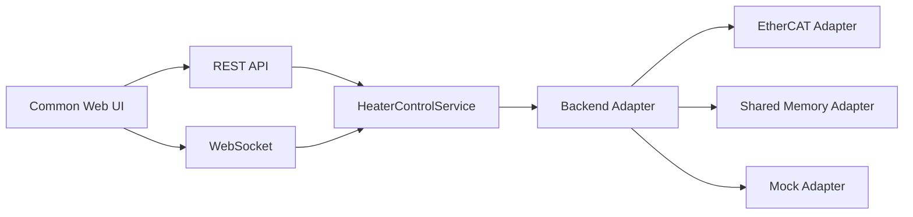
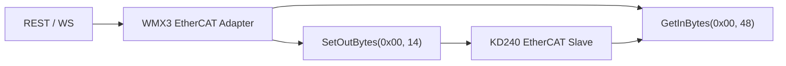
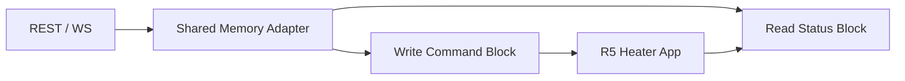
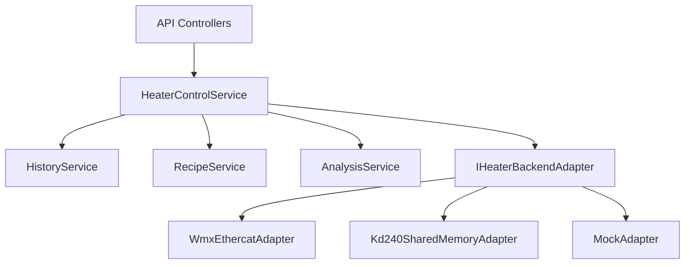

# KD240 Web Control API Contract

## 1. Purpose

This document proposes the REST API and WebSocket contract for the KD240 Heater Control Web UI.

The API must support two backend modes:

- EtherCAT mode through WMX3 and PDO I/O.
- Non-EtherCAT mode through KD240 A53 Linux shared memory.

The Web UI must use the same API in both modes.

## 2. Overall Structure



The API works with decoded JSON objects. Raw RxPDO and TxPDO bytes are internal to the adapter/protocol layer.

## 3. EtherCAT Version Structure



EtherCAT adapter behavior:

- Encode command fields into RxPDO 14 bytes.
- Decode TxPDO 48 bytes into common status JSON.
- Preserve pulse-and-clear commands for STOP, RESET, Auto Tune Start.

## 4. Non-EtherCAT Version Structure



Shared-memory adapter behavior:

- Convert Web commands to `SharedMemory_t` command block writes.
- Convert R5 status block to the same common status JSON shape as EtherCAT mode.
- Handle seqlock/cache/mapping safety inside the adapter.

## 5. v4.5 GUI Feature to Web API Mapping

| v4.5 GUI Feature | REST API | WebSocket |
|---|---|---|
| Connect | `POST /api/connect` | `adapter.state` |
| Disconnect | `POST /api/disconnect` | `adapter.state` |
| Read Once | `GET /api/status` | optional `status.snapshot` |
| Live Poll | none, automatic after connect | `status.snapshot`, `history.batch` |
| RUN | `POST /api/control/run` | `event.log`, `status.snapshot` |
| STOP | `POST /api/control/stop` | `event.log`, `status.snapshot` |
| RESET | `POST /api/control/reset` | `event.log`, `status.snapshot` |
| Write Params | `POST /api/control/params` | `event.log` |
| Auto Tune Start | `POST /api/autotune/start` | `autotune.event` |
| Apply Tuned Gain | `POST /api/autotune/apply` | `event.log`, `status.snapshot` |
| Auto Apply After DONE | `POST /api/autotune/auto-apply` | `autotune.event` |
| Recipe Save | `POST /api/recipes` | `event.log` |
| Recipe Load | `GET /api/recipes/{id}` | none |
| CSV Save | `GET /api/export/csv` | none |
| PNG Save | client-side chart export | none |
| Analyze | `POST /api/analysis/report` | optional `analysis.result` |
| Log Console | none | `event.log` |

## 6. RxPDO 14 Byte Overview

REST commands map to the following RxPDO layout in EtherCAT mode.

| Offset | Size | Field |
|---:|---:|---|
| 0 | 2 | ControlWord |
| 2 | 4 | TargetTempRaw |
| 6 | 4 | KpRaw |
| 10 | 4 | KiRaw |

The REST layer should not expose raw byte packing by default. It should expose:

- `target_temp`
- `kp`
- `ki`
- command name

## 7. TxPDO 48 Byte Overview

REST and WebSocket status messages should expose decoded fields from this TxPDO layout.

| Offset | Size | Field | JSON Field |
|---:|---:|---|---|
| 0 | 2 | StatusWord | `status_word` |
| 2 | 2 | State | `state_packed` |
| 4 | 4 | CurrentTempRaw | `current_temp` |
| 8 | 4 | ErrorRaw | `error` |
| 12 | 4 | UCtrlRaw | `u_ctrl` |
| 16 | 4 | DutyCnt | `duty_cnt` |
| 20 | 4 | TuneKRaw | `tune_k` |
| 24 | 4 | TuneLRaw | `tune_l` |
| 28 | 4 | TuneTRaw | `tune_t` |
| 32 | 4 | TuneKpRaw | `tune_kp` |
| 36 | 4 | TuneKiRaw | `tune_ki` |
| 40 | 4 | TunedGainValid | `tuned_gain_valid` |
| 44 | 4 | AutoTuneError | `auto_tune_error` |

## 8. REST API Draft

### Health and Mode

| Method | Path | Description |
|---|---|---|
| `GET` | `/api/health` | Process health |
| `GET` | `/api/mode` | Current backend adapter mode |
| `POST` | `/api/mode` | Change adapter mode |

Example mode response:

```json
{
  "ok": true,
  "mode": "ethercat",
  "available_modes": ["ethercat", "shared_memory", "mock"]
}
```

### Connection

| Method | Path | Description |
|---|---|---|
| `POST` | `/api/connect` | Connect active adapter |
| `POST` | `/api/disconnect` | Disconnect active adapter |
| `GET` | `/api/adapter/diagnostics` | Adapter diagnostics |

### Status

| Method | Path | Description |
|---|---|---|
| `GET` | `/api/status` | Latest status snapshot |
| `GET` | `/api/history` | Trend history |
| `DELETE` | `/api/history` | Clear trend history |

### Control

| Method | Path | Description |
|---|---|---|
| `POST` | `/api/control/params` | Update target/Kp/Ki |
| `POST` | `/api/control/run` | RUN |
| `POST` | `/api/control/stop` | STOP |
| `POST` | `/api/control/reset` | RESET |
| `POST` | `/api/control/clear` | Clear pulse command |

Request body:

```json
{
  "target_temp": 80.0,
  "kp": 0.04,
  "ki": 0.003
}
```

### Auto Tune

| Method | Path | Description |
|---|---|---|
| `POST` | `/api/autotune/start` | Start Auto Tune |
| `POST` | `/api/autotune/apply` | Apply valid tuned gain and RUN |
| `POST` | `/api/autotune/auto-apply` | Enable/disable Auto Apply after DONE |

Auto Apply request:

```json
{
  "enabled": true,
  "delay_ms": 300
}
```

### Recipe

| Method | Path | Description |
|---|---|---|
| `GET` | `/api/recipes` | List recipes |
| `POST` | `/api/recipes` | Save recipe |
| `GET` | `/api/recipes/{id}` | Load recipe |
| `DELETE` | `/api/recipes/{id}` | Delete recipe |

Recipe body:

```json
{
  "name": "80C tuned run",
  "target_temp": 80.0,
  "preferred_gain_source": "tuned",
  "preferred_kp": 0.038,
  "preferred_ki": 0.0028,
  "manual_entry_kp": 0.04,
  "manual_entry_ki": 0.003,
  "tune_k": 119.5,
  "tune_l": 1.28,
  "tune_t": 48.0,
  "tuned_gain_valid": true
}
```

### Export and Analysis

| Method | Path | Description |
|---|---|---|
| `GET` | `/api/export/csv` | Export trend history CSV |
| `POST` | `/api/analysis/report` | Calculate Control Quality Report |

Analysis request:

```json
{
  "range": "latest_run",
  "criteria": {
    "overshoot_limit": 2.0,
    "final_error_limit": 1.0,
    "stable_band": 1.0,
    "saturation_limit_percent": 30.0
  }
}
```

## 9. WebSocket Message Draft

Endpoint:

- `/ws`

### `status.snapshot`

```json
{
  "type": "status.snapshot",
  "seq": 10,
  "timestamp": "2026-06-11T16:30:00.000+09:00",
  "adapter": "ethercat",
  "connected": true,
  "status": {
    "heater_state": 1,
    "heater_state_name": "RUN",
    "auto_tune_state": 0,
    "auto_tune_state_name": "IDLE",
    "current_temp": 76.5,
    "error": 3.5,
    "u_ctrl": 0.42,
    "u_percent": 42.0,
    "duty_cnt": 42000,
    "duty_percent": 42.0,
    "tuned_gain_valid": false
  }
}
```

### `history.batch`

```json
{
  "type": "history.batch",
  "seq": 10,
  "samples": [
    {
      "time_sec": 12.4,
      "target_temp": 80.0,
      "current_temp": 76.5,
      "error": 3.5,
      "u_percent": 42.0,
      "duty_percent": 42.0,
      "heater_state": 1
    }
  ]
}
```

### `event.log`

```json
{
  "type": "event.log",
  "timestamp": "2026-06-11T16:30:00.000+09:00",
  "level": "info",
  "message": "RUN command sent",
  "context": {
    "target_temp": 80.0,
    "kp": 0.04,
    "ki": 0.003
  }
}
```

### `adapter.state`

```json
{
  "type": "adapter.state",
  "adapter": "shared_memory",
  "connected": true,
  "fault": null
}
```

### `autotune.event`

```json
{
  "type": "autotune.event",
  "auto_tune_state": 4,
  "auto_tune_state_name": "DONE",
  "tuned_gain_valid": true,
  "auto_apply_scheduled": true
}
```

## 10. Backend Adapter Structure



Adapter result rules:

- Every command returns `ok`, `message`, and optionally a status snapshot.
- Adapter-specific errors must be normalized.
- Raw bytes may be returned only in diagnostics, not in primary UI state.

## 11. Implementation Order

1. Define DTOs for command, status, history sample, recipe, and report.
2. Implement mock adapter and WebSocket stream.
3. Build Web UI against mock data.
4. Implement REST control endpoints.
5. Implement history and CSV export.
6. Implement analysis report from v4.5 logic.
7. Implement EtherCAT adapter.
8. Implement shared-memory adapter.
9. Add adapter diagnostics and operational logs.
10. Document legacy v4.5 equivalence tests.

