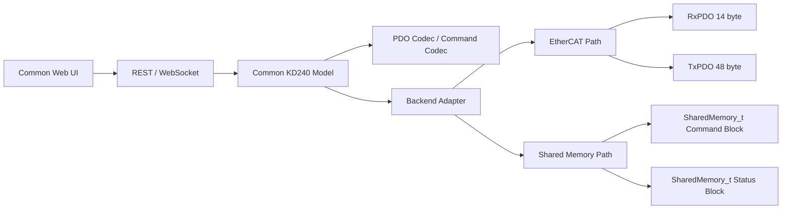
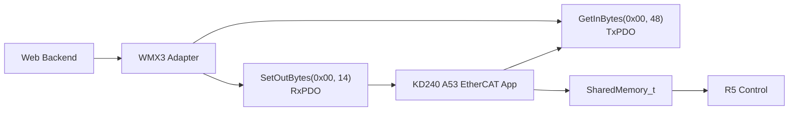
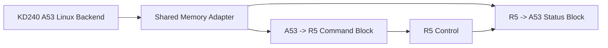
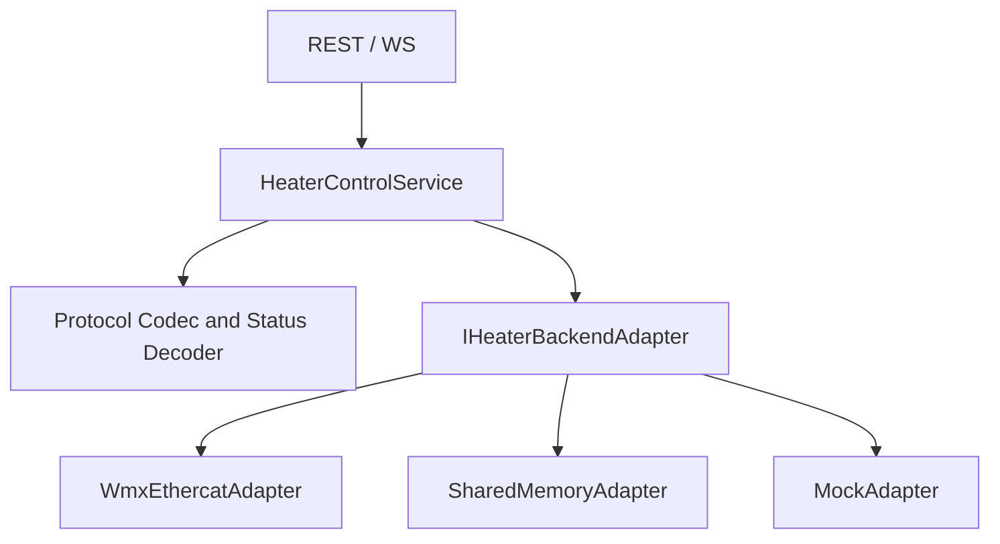

# KD240 Heater Control Protocol

## 1. Purpose

This document defines the KD240 Heater Control command/status protocol used by the new Web Control system.

The protocol baseline is the legacy v4.5 GUI:

- `09_GUI/kd240_heater_ethercat_gui_v4_5_report_layout_fix.py`
- RxPDO 14 bytes
- TxPDO 48 bytes
- IEEE754 float encoded as little-endian UINT32 raw
- ControlWord pulse and clear behavior
- Packed heater and Auto Tune state

The same logical protocol must be used by both backend versions:

- EtherCAT version: Web backend talks through WMX3 PDO I/O.
- Non-EtherCAT version: Web backend talks directly to KD240 A53/R5 shared memory.

## 2. Overall Structure



The Web UI should consume decoded JSON fields, not raw PDO bytes.

## 3. EtherCAT Version Structure



In this version, the backend must preserve v4.5 pulse semantics:

1. Write command pulse.
2. Wait a short command clear delay.
3. Write `CTRL_CLEAR`.
4. Read status.

## 4. Non-EtherCAT Version Structure



In this version, raw PDO bytes are not required internally. However, the public API should still expose the same command/status fields as the EtherCAT version.

## 5. v4.5 GUI Feature to Protocol Mapping

| v4.5 Feature | Protocol Field or Command | Web Model |
|---|---|---|
| Target input | `TargetTempRaw` | `target_temp` |
| Kp input | `KpRaw` | `kp` |
| Ki input | `KiRaw` | `ki` |
| RUN | `ControlWord = 0x0001` | `control.run` |
| STOP | `ControlWord = 0x0002` pulse | `control.stop` |
| RESET | `ControlWord = 0x0004` pulse | `control.reset` |
| Auto Tune Start | `ControlWord = 0x0008` pulse | `autotune.start` |
| Apply Tuned Gain | v4.5 copies tuned gain then sends RUN | `autotune.apply` |
| Live status | TxPDO 48 bytes | `status.snapshot` |
| Auto Tune phase | packed `State` high byte | `auto_tune_state` |
| Heater phase | packed `State` low byte | `heater_state` |
| Gain result | TxPDO offsets 20..44 | `tune_*`, `tuned_gain_valid` |
| CSV / PNG / Analyze | Trend history rows | `history` and `analysis` API |

## 6. RxPDO 14 Byte Overview

RxPDO is master to slave data.

Byte order:

- Little-endian.
- Float values are encoded as IEEE754 single-precision raw UINT32.

Layout:

| Offset | Size | Field | Type | Web Field |
|---:|---:|---|---|---|
| 0 | 2 | ControlWord | UINT16 | `control_word` |
| 2 | 4 | TargetTempRaw | UINT32 | `target_temp` |
| 6 | 4 | KpRaw | UINT32 | `kp` |
| 10 | 4 | KiRaw | UINT32 | `ki` |

### ControlWord

| Value | Name | Scope | Expected Behavior |
|---:|---|---|---|
| `0x0000` | CLEAR | EtherCAT / GUI | Clear pulse command |
| `0x0001` | RUN | EtherCAT / shared memory compatible | Start or keep PI control |
| `0x0002` | STOP | EtherCAT / shared memory compatible | Stop heater |
| `0x0004` | RESET | EtherCAT / shared memory compatible, R5 path incomplete in current code | Reset state |
| `0x0008` | AUTO_TUNE_START | EtherCAT / shared memory compatible | Start Auto Tune |
| `0x0010` | APPLY_TUNED_GAIN | EtherCAT GUI scope only | Backend should convert to tuned RUN |

Important scope warning:

`0x0010` is `APPLY_TUNED_GAIN` in the legacy EtherCAT GUI, but `SHM_CONTROL_AUTO_TUNE_ABORT` in `shared_memory.h`. The Web backend must not forward `0x0010` blindly to shared memory.

## 7. TxPDO 48 Byte Overview

TxPDO is slave to master data.

Layout:

| Offset | Size | Field | Type | Web Field |
|---:|---:|---|---|---|
| 0 | 2 | StatusWord | UINT16 | `status_word` |
| 2 | 2 | State | UINT16 | `state_packed` |
| 4 | 4 | CurrentTempRaw | UINT32 | `current_temp` |
| 8 | 4 | ErrorRaw | UINT32 | `error` |
| 12 | 4 | UCtrlRaw | UINT32 | `u_ctrl` |
| 16 | 4 | DutyCnt | UINT32 | `duty_cnt` |
| 20 | 4 | TuneKRaw | UINT32 | `tune_k` |
| 24 | 4 | TuneLRaw | UINT32 | `tune_l` |
| 28 | 4 | TuneTRaw | UINT32 | `tune_t` |
| 32 | 4 | TuneKpRaw | UINT32 | `tune_kp` |
| 36 | 4 | TuneKiRaw | UINT32 | `tune_ki` |
| 40 | 4 | TunedGainValid | UINT32 | `tuned_gain_valid` |
| 44 | 4 | AutoTuneError | UINT32 | `auto_tune_error` |

### Packed State

| Bits | Field |
|---|---|
| 0..7 | heater state |
| 8..15 | Auto Tune state |

Heater states:

| Value | Name |
|---:|---|
| 0 | `IDLE` |
| 1 | `RUN` |
| 2 | `STABLE` |
| 3 | `FAULT` |
| 4 | `AUTO_TUNE` |

Auto Tune states:

| Value | Name |
|---:|---|
| 0 | `IDLE` |
| 1 | `STABILIZE` |
| 2 | `STEP_TEST` |
| 3 | `CALCULATE` |
| 4 | `DONE` |
| 5 | `FAIL` |
| 6 | `ABORT` |

### StatusWord

| Value | Name | Web Boolean |
|---:|---|---|
| `0x0001` | RUN | `is_run` |
| `0x0002` | STABLE | `is_stable` |
| `0x0004` | FAULT | `is_fault` |
| `0x0008` | AUTO_TUNE | `is_auto_tune` |
| `0x0010` | AUTO_TUNE_DONE | `auto_tune_done` |
| `0x0020` | AUTO_TUNE_FAIL_ABORT | `auto_tune_fail_or_abort` |
| `0x0040` | TUNED_GAIN_VALID | `tuned_gain_valid_flag` |

## 8. REST API Draft

The REST API should use decoded protocol fields.

| Method | Path | Protocol Action |
|---|---|---|
| `GET` | `/api/status` | Read TxPDO or shared-memory status |
| `POST` | `/api/control/run` | Encode target/Kp/Ki, send RUN |
| `POST` | `/api/control/stop` | Send STOP |
| `POST` | `/api/control/reset` | Send RESET |
| `POST` | `/api/control/params` | Write target/Kp/Ki |
| `POST` | `/api/control/clear` | Clear command word if adapter supports pulses |
| `POST` | `/api/autotune/start` | Send AUTO_TUNE_START |
| `POST` | `/api/autotune/apply` | Read valid tuned gain, send RUN with tuned Kp/Ki |
| `GET` | `/api/history` | Return decoded trend rows |
| `GET` | `/api/export/csv` | Return CSV from trend rows |
| `POST` | `/api/analysis/report` | Calculate quality metrics |

Common command payload:

```json
{
  "target_temp": 80.0,
  "kp": 0.04,
  "ki": 0.003
}
```

Common status response:

```json
{
  "ok": true,
  "adapter": "ethercat",
  "connected": true,
  "status": {
    "status_word": 81,
    "state_packed": 1025,
    "heater_state": 1,
    "heater_state_name": "RUN",
    "auto_tune_state": 4,
    "auto_tune_state_name": "DONE",
    "current_temp": 79.2,
    "error": 0.8,
    "u_ctrl": 0.35,
    "u_percent": 35.0,
    "duty_cnt": 35000,
    "duty_percent": 35.0,
    "tune_k": 119.5,
    "tune_l": 1.28,
    "tune_t": 48.0,
    "tune_kp": 0.038,
    "tune_ki": 0.0028,
    "tuned_gain_valid": true,
    "auto_tune_error": 0
  }
}
```

## 9. WebSocket Message Draft

Recommended endpoint:

- `/ws`

Recommended messages:

```json
{
  "type": "status.snapshot",
  "seq": 1,
  "status": {}
}
```

```json
{
  "type": "history.batch",
  "seq": 1,
  "samples": []
}
```

```json
{
  "type": "event.log",
  "level": "info",
  "message": "RUN command sent"
}
```

```json
{
  "type": "autotune.event",
  "phase": "STEP_TEST",
  "auto_tune_state": 2
}
```

## 10. Backend Adapter Structure

The protocol layer should be shared by every adapter.



Adapter interface:

| Method | Protocol Use |
|---|---|
| `read_status()` | Produce decoded TxPDO-equivalent status |
| `run(target,kp,ki)` | RUN |
| `stop()` | STOP |
| `reset()` | RESET |
| `write_params(target,kp,ki)` | Parameter update |
| `start_auto_tune(target,kp,ki)` | Auto Tune start |
| `apply_tuned_gain(target)` | Tuned Kp/Ki to RUN |
| `clear_command()` | EtherCAT pulse cleanup |

## 11. Implementation Order

1. Extract the protocol constants from v4.5 into a language-neutral definition.
2. Write protocol codec tests for RxPDO 14 and TxPDO 48 using known sample values.
3. Define the common status DTO and command DTO.
4. Build mock adapter.
5. Build REST and WebSocket around the mock adapter.
6. Port CSV and analysis logic to common backend or frontend modules.
7. Implement EtherCAT adapter using WMX3.
8. Implement shared-memory adapter for KD240 Linux.
9. Confirm both adapters return identical JSON status shape.
10. Preserve `09_GUI` as legacy and do not mix new Web code into it.

