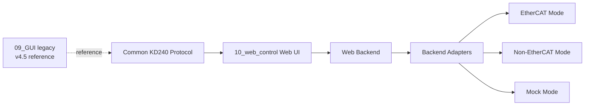
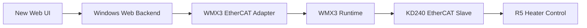
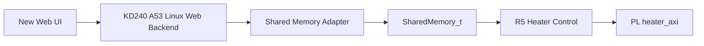
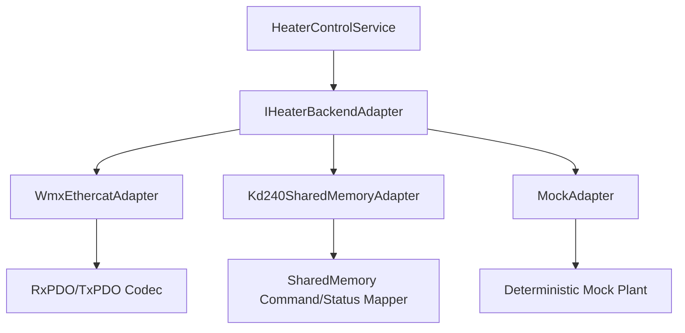

# KD240 Web Control Migration Plan

## 1. Purpose

This document defines the migration plan from the legacy `09_GUI` Windows Tkinter GUI to a new KD240 Heater Control Web UI.

The legacy GUI remains preserved. The new Web Control project should be created separately under `10_web_control`.

The team lead's Python Web UI file is not the base for the new implementation. It is only a reference that proves Web UI, REST API, and WebSocket are feasible.

## 2. Overall Target Structure



Migration principle:

> Do not port the v4.5 GUI class directly. Extract its protocol, behavior, and operator workflow into a new modular Web Control system.

## 3. EtherCAT Version Structure

The EtherCAT migration path preserves the current runtime behavior.



### EtherCAT Migration Inputs

| Existing Asset | Migration Role |
|---|---|
| `09_GUI/kd240_heater_ethercat_gui_v4_5_report_layout_fix.py` | Behavior reference |
| `07_export/PIC32_EtherCAT_Slave_heater_txpdo48.xml` | 48-byte ESI reference |
| `07_export/0050524f_00009252.txt` | ENI/WMX mapping reference |
| A53 EtherCAT app | Runtime bridge |
| R5 heater app | Control owner |

## 4. Non-EtherCAT Version Structure

The non-EtherCAT migration path removes the PC EtherCAT master.



### Non-EtherCAT Migration Inputs

| Existing Asset | Migration Role |
|---|---|
| `02_vitis/kd240_ecat_slave_app/src/shared_memory.h` | Shared memory layout reference |
| `02_vitis/kd240_ecat_slave_app/src/a53_shared_memory.c` | A53 command/status access behavior |
| `02_vitis/r5_heater_axi_test/src/r5_shared_memory.c` | R5 seqlock/status behavior |
| `02_vitis/r5_heater_axi_test/src/r5_heater_app.c` | R5 command handling reference |

Key migration issue:

- User-space access to shared memory on A53 Linux must be designed before final implementation.

## 5. v4.5 GUI Feature to Web UI Migration Map

| v4.5 GUI Function | Keep as Legacy? | New Web Location | Migration Notes |
|---|---:|---|---|
| `make_rxpdo()` | Reference only | protocol codec | Same byte layout |
| `parse_txpdo()` | Reference only | protocol codec | Same 48-byte layout |
| `connect()` | No direct port | backend adapter | WMX only in EtherCAT adapter |
| `write_output()` | No direct port | adapter command methods | Hide raw bytes from UI |
| `read_input()` | No direct port | adapter status method | Return decoded JSON |
| `run_heater()` | Workflow reference | REST `control/run` | Keep pulse/clear in adapter |
| `stop_heater()` | Workflow reference | REST `control/stop` | Keep pulse/clear in adapter |
| `reset_heater()` | Workflow reference | REST `control/reset` | R5 reset behavior may need validation |
| `start_auto_tune()` | Workflow reference | REST `autotune/start` | Keep Auto Tune phase events |
| `use_tuned_gain_and_run()` | Workflow reference | REST `autotune/apply` | Backend reads tuned status then RUN |
| `check_auto_apply_after_done()` | Workflow reference | service or UI option | Prefer backend monitor for consistency |
| `append_log_sample()` | Concept only | history service | Store normalized samples |
| `save_recipe()` / `load_recipe()` | Concept only | recipe API | JSON schema can be reused |
| `save_csv()` | Concept only | export API | Same columns where useful |
| `save_png()` | Concept only | client chart export | Browser can export chart |
| `analyze()` | Logic reference | analysis service/page | Port metrics, not Tk window |

## 6. RxPDO 14 Byte / TxPDO 48 Byte Migration Scope

### RxPDO 14 Byte

| Offset | Field | Migration Target |
|---:|---|---|
| 0 | ControlWord | command DTO |
| 2 | TargetTempRaw | `target_temp` |
| 6 | KpRaw | `kp` |
| 10 | KiRaw | `ki` |

### TxPDO 48 Byte

| Offset | Field | Migration Target |
|---:|---|---|
| 0 | StatusWord | status DTO |
| 2 | State | heater and Auto Tune state fields |
| 4 | CurrentTempRaw | trend/status |
| 8 | ErrorRaw | trend/status |
| 12 | UCtrlRaw | trend/status |
| 16 | DutyCnt | trend/status |
| 20 | TuneKRaw | Auto Tune result |
| 24 | TuneLRaw | Auto Tune result |
| 28 | TuneTRaw | Auto Tune result |
| 32 | TuneKpRaw | tuned gain |
| 36 | TuneKiRaw | tuned gain |
| 40 | TunedGainValid | tuned gain valid |
| 44 | AutoTuneError | Auto Tune error |

The Web Control system should treat this as the canonical status contract even when EtherCAT is not used.

## 7. REST API Draft for Migration

Minimum first phase:

| Phase | Method | Path | Purpose |
|---|---|---|---|
| 1 | `GET` | `/api/health` | Backend alive |
| 1 | `GET` | `/api/status` | Latest status |
| 1 | `POST` | `/api/control/run` | RUN |
| 1 | `POST` | `/api/control/stop` | STOP |
| 1 | `POST` | `/api/control/reset` | RESET |
| 1 | `POST` | `/api/autotune/start` | Auto Tune Start |
| 1 | `POST` | `/api/autotune/apply` | Apply tuned gain |
| 2 | `GET` | `/api/history` | Trend data |
| 2 | `DELETE` | `/api/history` | Clear trend |
| 2 | `GET` | `/api/export/csv` | CSV |
| 2 | `POST` | `/api/analysis/report` | Report |
| 3 | `GET/POST` | `/api/recipes` | Recipe |

## 8. WebSocket Message Draft for Migration

Start with these message types:

| Type | Purpose |
|---|---|
| `status.snapshot` | Replaces v4.5 live labels |
| `history.batch` | Replaces Matplotlib live trend updates |
| `event.log` | Replaces Tk log console |
| `adapter.state` | Replaces Connect/Disconnect badge |
| `autotune.event` | Replaces Auto Tune phase log |

Minimum sample:

```json
{
  "type": "status.snapshot",
  "seq": 1,
  "status": {
    "heater_state_name": "RUN",
    "auto_tune_state_name": "IDLE",
    "current_temp": 76.5,
    "error": 3.5,
    "u_percent": 42.0,
    "duty_percent": 42.0
  }
}
```

## 9. Backend Adapter Migration Structure



Adapter migration rules:

- All adapters return the same status DTO.
- All adapters accept the same command DTO.
- EtherCAT adapter owns WMX3.
- Shared-memory adapter owns mmap/UIO/kernel-driver access.
- Mock adapter owns fake status generation for UI development.

## 10. Step-by-Step Implementation Plan

### Phase 0: Preserve Legacy

1. Treat `09_GUI` as read-only legacy.
2. Identify v4.5 as the official legacy behavior.
3. Keep old CSV/PNG samples as report/export references.

### Phase 1: Protocol and API Foundation

1. Create protocol constants from v4.5.
2. Define command DTO and status DTO.
3. Define REST and WebSocket contract.
4. Add protocol tests using known byte layouts.

### Phase 2: Mock Web Control

1. Build mock backend adapter.
2. Build Web UI live status and trend chart.
3. Build RUN/STOP/RESET/Auto Tune UI commands against mock.
4. Build event log.

### Phase 3: Report and Recipe

1. Port v4.5 recipe schema.
2. Port CSV export columns.
3. Port Analyze metrics:
   - overshoot
   - time to STABLE
   - final error average
   - oscillation count
   - saturation ratio
   - fault occurrence
4. Implement Control Quality Report page.

### Phase 4: EtherCAT Adapter

1. Implement WMX connect/disconnect.
2. Implement `SetOutBytes(0x00, 14)`.
3. Implement `GetInBytes(0x00, 48)`.
4. Confirm ESI/ENI 48-byte mapping.
5. Compare Web status with v4.5 GUI status.

### Phase 5: Non-EtherCAT Adapter

1. Decide Linux shared-memory access method.
2. Implement status read only.
3. Validate R5 heartbeat and status seqlock.
4. Implement RUN/STOP.
5. Implement Auto Tune Start and Apply.
6. Validate Web status against R5 UART/debug observations.

### Phase 6: Stabilization

1. Add adapter diagnostics.
2. Add error recovery rules.
3. Add startup mode configuration.
4. Add operator documentation.
5. Keep v4.5 GUI available as fallback during transition.

