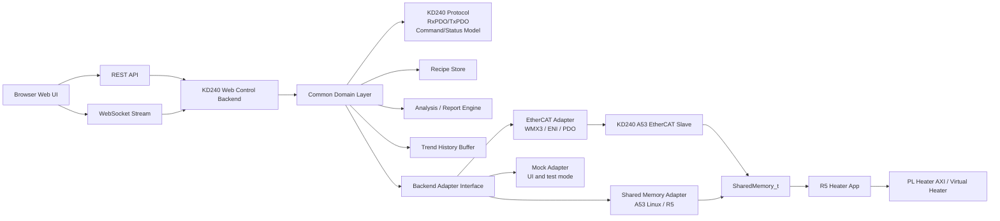
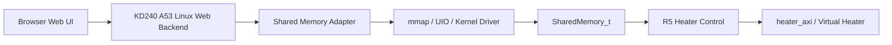

# KD240 Heater Control Web Architecture

## 1. Purpose

This document defines the proposed Web Control architecture for the KD240 Heater Control project.

The baseline is the legacy Windows GUI:

- `09_GUI/kd240_heater_ethercat_gui_v4_5_report_layout_fix.py`
- RxPDO 14 bytes
- TxPDO 48 bytes
- WMX3 EtherCAT master I/O
- RUN / STOP / RESET
- Setpoint / Kp / Ki
- Auto Tune Start
- Apply Tuned Gain
- Recipe
- CSV / PNG export
- Control Quality Report

The team lead's Python Web UI file is treated only as a feasibility reference for Web UI, REST API, and WebSocket. The new Web Control system should be designed for this KD240 project and should not inherit the single-file simulation-oriented structure.

Existing `09_GUI` files are preserved as legacy reference material.

## 2. Overall Structure

The Web UI should be common. Hardware access should be selected through backend adapters.



The main architectural rule is:

> The Web UI must not know whether the backend uses EtherCAT or direct shared memory.

## 3. EtherCAT Version Structure

The EtherCAT version keeps the current WMX3 master path but replaces the Tkinter GUI with a Web UI.

```mermaid
flowchart LR
    Browser["Browser Web UI"] --> Backend["Windows Web Backend"]
    Backend --> WmxAdapter["WMX3 EtherCAT Adapter"]
    WmxAdapter --> WMX["WMX3 Runtime"]
    WMX --> ENI["ENI<br/>IoOutput 14 / IoInput 48"]
    ENI --> LAN9252["LAN9252 EtherCAT Slave"]
    LAN9252 --> A53["KD240 A53 EtherCAT App"]
    A53 --> SHM["SharedMemory_t"]
    SHM --> R5["R5 Heater Control"]
    R5 --> PL["heater_axi / Virtual Heater"]
```



### EtherCAT Version Responsibilities

| Layer | Responsibility |
|---|---|
| Web UI | Operator controls, status, trend, recipe, report |
| REST/WebSocket backend | API, session state, history, command sequencing |
| WMX3 adapter | `SetOutBytes(0x00, 14)`, `GetInBytes(0x00, 48)` |
| ENI/ESI | 14-byte RxPDO and 48-byte TxPDO mapping |
| A53 EtherCAT app | RxPDO to Shared Memory, Shared Memory to TxPDO |
| R5 | PI control, stable judgement, Auto Tune |

The EtherCAT version is useful when WMX3 and the PC-based EtherCAT master remain part of the test or deployment environment.

## 4. Non-EtherCAT Version Structure

The non-EtherCAT version removes Windows WMX3 and EtherCAT from the runtime path.



### Non-EtherCAT Version Responsibilities

| Layer | Responsibility |
|---|---|
| Web UI | Same as EtherCAT version |
| REST/WebSocket backend | Same public API as EtherCAT version |
| Shared Memory adapter | Write A53 command block, read R5 status block |
| R5 | Same control owner as current design |
| PL | Same heater AXI / virtual heater logic |

The non-EtherCAT version is the cleaner target for KD240 standalone Web Control.

Critical implementation decision:

- How A53 Linux exposes `SharedMemory_t` safely to user space.
- Preferred options: reserved-memory + UIO, small kernel driver, or non-cacheable mapping.
- Avoid ad hoc `/dev/mem` access for final deployment.

## 5. v4.5 GUI to Web UI Feature Mapping

| v4.5 GUI Feature | Current Location | Web UI Equivalent | Backend Requirement |
|---|---|---|---|
| Connect / Disconnect | WMX3 `CreateDevice`, `CloseDevice` | Backend connection status panel | Adapter `connect()`, `disconnect()` |
| Read Once | `GetInBytes(0x00, 48)` | REST `GET /api/status` | Adapter `read_status()` |
| Live Polling | Tk `after(200)` polling | WebSocket status stream | Adapter polling or backend scheduler |
| RUN | RxPDO `CTRL_RUN`, then clear | `POST /api/control/run` | Adapter `run(target,kp,ki)` |
| STOP | RxPDO `CTRL_STOP_PULSE`, then clear | `POST /api/control/stop` | Adapter `stop()` |
| RESET | RxPDO `CTRL_RESET_PULSE`, then clear | `POST /api/control/reset` | Adapter `reset()` |
| Write Params | Current ControlWord + target/Kp/Ki | `POST /api/control/params` | Adapter `write_params()` |
| Setpoint | `TargetTempRaw` | Web numeric input | Protocol encode/decode |
| Gain | `KpRaw`, `KiRaw` | Web numeric inputs | Protocol encode/decode |
| Auto Tune Start | `CTRL_AUTO_TUNE_START` pulse | `POST /api/autotune/start` | Adapter pulse command |
| Apply Tuned Gain | Copy tuned gain, send RUN | `POST /api/autotune/apply` | Backend reads last status, sends RUN |
| Auto Apply After DONE | GUI checks status while polling | Backend or UI option | Event-driven Auto Tune monitor |
| Live Status | Tk labels | Web status cards | Common status DTO |
| Trend Chart | Matplotlib | Browser chart component | WebSocket history batch |
| Recipe Save / Load | Local JSON | REST recipe API | Recipe store |
| Save CSV | Local CSV | `GET /api/export/csv` | History export |
| Save PNG | Matplotlib savefig | Client-side chart export or backend render | Prefer client-side PNG |
| Analyze / Report | Tk report window | Web report page/modal | Common analysis engine |
| Log Console | Tk text area | Web event log panel | Backend event messages |

## 6. RxPDO 14 Byte Overview

Master to slave command layout.

| Offset | Size | Field | Type | Meaning |
|---:|---:|---|---|---|
| 0 | 2 | ControlWord | UINT16 | Command bit field |
| 2 | 4 | TargetTempRaw | UINT32 | IEEE754 float raw |
| 6 | 4 | KpRaw | UINT32 | IEEE754 float raw |
| 10 | 4 | KiRaw | UINT32 | IEEE754 float raw |

ControlWord bits:

| Bit | Value | EtherCAT Scope Meaning |
|---:|---:|---|
| 0 | `0x0001` | RUN |
| 1 | `0x0002` | STOP pulse |
| 2 | `0x0004` | RESET pulse |
| 3 | `0x0008` | AUTO_TUNE_START pulse |
| 4 | `0x0010` | APPLY_TUNED_GAIN in legacy GUI scope |

Important:

- In the current R5 shared-memory header, `0x0010` is `SHM_CONTROL_AUTO_TUNE_ABORT`.
- Therefore `apply_tuned_gain` should be a backend-level command, not blindly forwarded as a shared-memory bit.

## 7. TxPDO 48 Byte Overview

Slave to master status layout.

| Offset | Size | Field | Type | Meaning |
|---:|---:|---|---|---|
| 0 | 2 | StatusWord | UINT16 | Status bit field |
| 2 | 2 | State | UINT16 | low byte heater state, high byte Auto Tune state |
| 4 | 4 | CurrentTempRaw | UINT32 | IEEE754 float raw |
| 8 | 4 | ErrorRaw | UINT32 | IEEE754 float raw |
| 12 | 4 | UCtrlRaw | UINT32 | IEEE754 float raw |
| 16 | 4 | DutyCnt | UINT32 | PWM duty count |
| 20 | 4 | TuneKRaw | UINT32 | FOPDT K float raw |
| 24 | 4 | TuneLRaw | UINT32 | FOPDT L float raw |
| 28 | 4 | TuneTRaw | UINT32 | FOPDT T float raw |
| 32 | 4 | TuneKpRaw | UINT32 | Tuned Kp float raw |
| 36 | 4 | TuneKiRaw | UINT32 | Tuned Ki float raw |
| 40 | 4 | TunedGainValid | UINT32 | Valid flag |
| 44 | 4 | AutoTuneError | UINT32 | Auto Tune error code |

StatusWord bits:

| Bit | Value | Meaning |
|---:|---:|---|
| 0 | `0x0001` | RUN |
| 1 | `0x0002` | STABLE |
| 2 | `0x0004` | FAULT |
| 3 | `0x0008` | AUTO_TUNE |
| 4 | `0x0010` | AUTO_TUNE_DONE |
| 5 | `0x0020` | AUTO_TUNE_FAIL_OR_ABORT |
| 6 | `0x0040` | TUNED_GAIN_VALID |

## 8. REST API Draft

All public APIs should be adapter-independent.

| Method | Path | Purpose |
|---|---|---|
| `GET` | `/api/health` | Backend process health |
| `GET` | `/api/mode` | Active backend mode: `ethercat`, `shared_memory`, `mock` |
| `POST` | `/api/mode` | Select backend mode when allowed |
| `POST` | `/api/connect` | Connect backend adapter |
| `POST` | `/api/disconnect` | Disconnect backend adapter |
| `GET` | `/api/status` | Latest decoded status |
| `POST` | `/api/control/params` | Set target/Kp/Ki without changing run intent |
| `POST` | `/api/control/run` | Send RUN with target/Kp/Ki |
| `POST` | `/api/control/stop` | Send STOP |
| `POST` | `/api/control/reset` | Send RESET |
| `POST` | `/api/control/clear` | Clear command word where applicable |
| `POST` | `/api/autotune/start` | Start Auto Tune |
| `POST` | `/api/autotune/apply` | Apply tuned Kp/Ki and RUN |
| `POST` | `/api/autotune/auto-apply` | Enable/disable auto apply after DONE |
| `GET` | `/api/history` | Trend samples |
| `DELETE` | `/api/history` | Clear trend/history |
| `GET` | `/api/export/csv` | Export trend CSV |
| `POST` | `/api/analysis/report` | Calculate control quality report |
| `GET` | `/api/recipes` | List recipes |
| `POST` | `/api/recipes` | Save recipe |
| `GET` | `/api/recipes/{id}` | Load recipe |
| `DELETE` | `/api/recipes/{id}` | Delete recipe |

Example command body:

```json
{
  "target_temp": 80.0,
  "kp": 0.04,
  "ki": 0.003
}
```

## 9. WebSocket Message Draft

Use one WebSocket endpoint:

- `/ws`

Message types:

| Type | Direction | Purpose |
|---|---|---|
| `status.snapshot` | server to client | Latest decoded status |
| `history.batch` | server to client | Trend samples |
| `event.log` | server to client | Operator/system event |
| `adapter.state` | server to client | Connected/disconnected/fault |
| `autotune.event` | server to client | Auto Tune phase changes |
| `analysis.result` | server to client | Optional async report result |

Example status message:

```json
{
  "type": "status.snapshot",
  "seq": 1024,
  "timestamp": "2026-06-11T16:30:00.000+09:00",
  "adapter": "ethercat",
  "connected": true,
  "status": {
    "status_word": 81,
    "heater_state": 1,
    "heater_state_name": "RUN",
    "auto_tune_state": 4,
    "auto_tune_state_name": "DONE",
    "current_temp": 79.2,
    "error": 0.8,
    "u_ctrl": 0.35,
    "u_percent": 35.0,
    "duty_cnt": 35000,
    "duty_percent": 35.0,
    "tune_k": 119.5,
    "tune_l": 1.28,
    "tune_t": 48.0,
    "tune_kp": 0.038,
    "tune_ki": 0.0028,
    "tuned_gain_valid": true,
    "auto_tune_error": 0
  }
}
```

## 10. Backend Adapter Structure

Common interface:

| Method | Meaning |
|---|---|
| `connect()` | Initialize backend |
| `disconnect()` | Release backend |
| `read_status()` | Return common decoded status |
| `write_params(target,kp,ki)` | Write target/gain using current command context |
| `run(target,kp,ki)` | Start/maintain RUN |
| `stop()` | Stop heater |
| `reset()` | Reset heater state |
| `start_auto_tune(target,kp,ki)` | Send Auto Tune start |
| `apply_tuned_gain(target)` | Apply latest valid tuned gain and run |
| `clear_command()` | Clear pulse command when adapter needs it |
| `get_diagnostics()` | Adapter-specific health data |

Adapters:

| Adapter | Runtime | Role |
|---|---|---|
| `wmx_ethercat` | Windows | WMX3 `SetOutBytes` / `GetInBytes` |
| `kd240_shared_memory` | KD240 A53 Linux | mmap/shared-memory command/status |
| `mock` | Any | UI development and automated tests |

## 11. Implementation Order

1. Freeze protocol definitions from v4.5.
2. Create document-only architecture and API contract.
3. Create mock backend and Web UI skeleton.
4. Implement common status model, trend history, recipe schema, analysis logic.
5. Implement EtherCAT adapter using v4.5 behavior.
6. Validate EtherCAT with `PIC32_EtherCAT_Slave_heater_txpdo48.xml` and `0050524f_00009252.txt`.
7. Implement shared-memory adapter for KD240 A53 Linux.
8. Validate non-EtherCAT path with R5 heartbeat/status first, then commands.
9. Add CSV export, chart PNG export, and Control Quality Report.
10. Preserve `09_GUI` as legacy and add migration notes.

